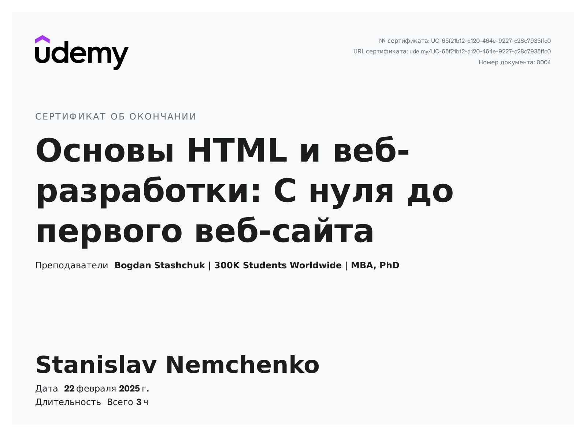

Key technologies and software:  

<ul>
	  <li>How to create, save, and view HTML documents in a web browser;</li>
	  <li>How to add basic HTML elements and use Bootstrap styles;</li>
	  <li>How to apply CSS for custom styling;</li>
	  <li>How to create simple, yet attractive and user-friendly websites.</li>
	  <li>A web browser (such as Chrome) and a text editor for writing HTML and CSS code, such as Visual Studio Code</li>
	  <li>Certificate HTML Fundamentals and Web Development: <b><a href="https://www.udemy.com/certificate/UC-65f21b12-d120-464e-9227-c28c7935ffc0/" target="_blank">From Zero to First Website</a></b></li>
	  <li></li>
</ul>
